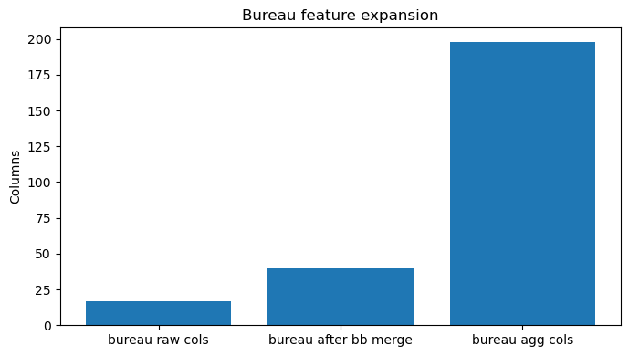
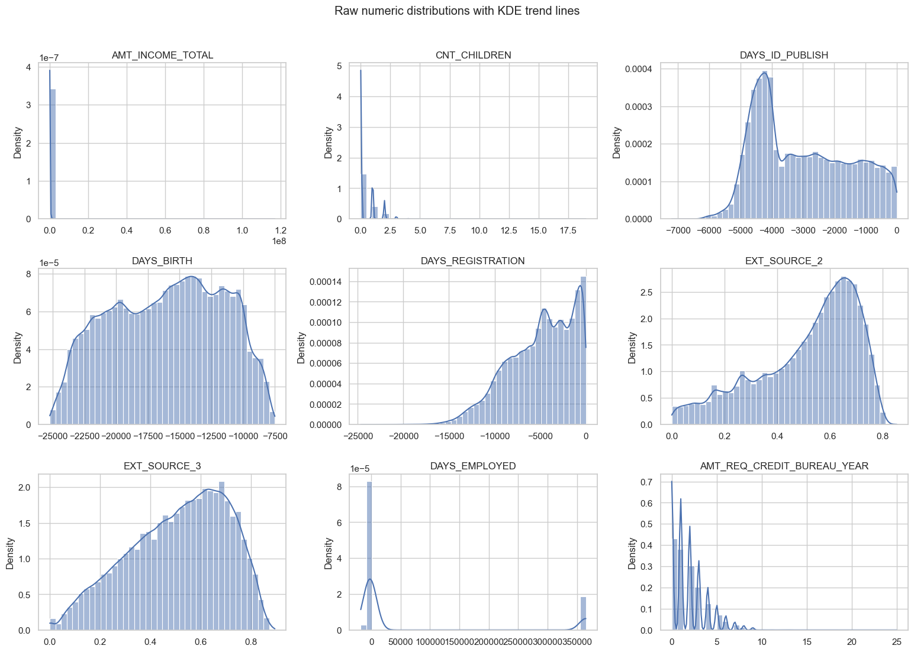
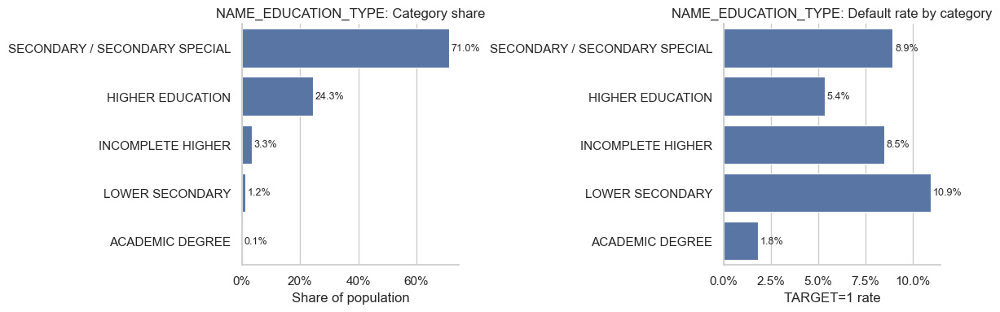
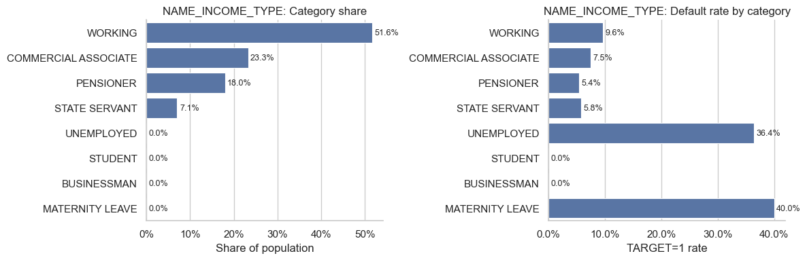
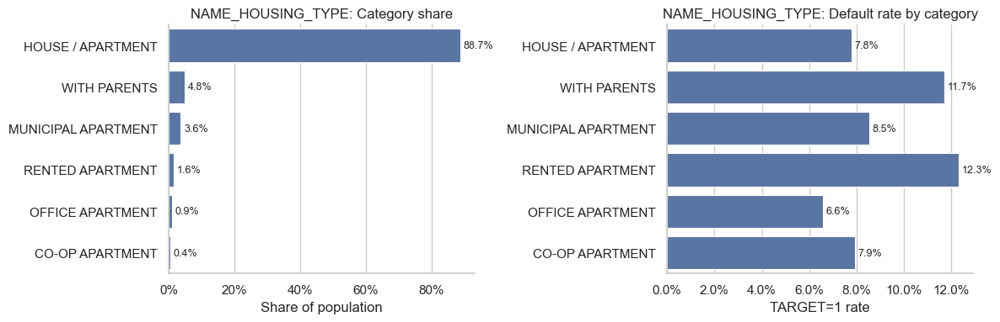
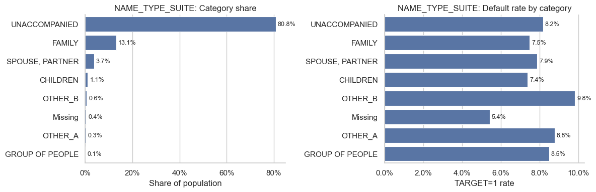
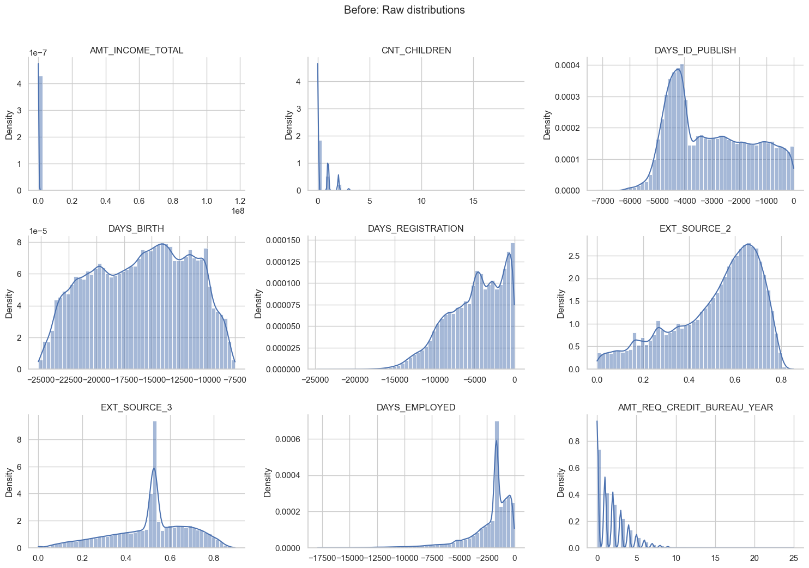
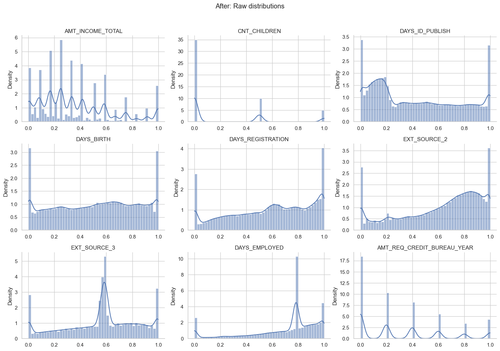

# Appendix
## Project 1 Supporting Tables and Extended Figures

This appendix contains detailed diagnostics and overflow visual content not included in the main 12-page `Report.pdf`.

## A. Extended Audit Tables

### A1. Duplicate and Key-Integrity Audit

| Table | Duplicate rows | Row count |
| --- | ---: | ---: |
| train | 0 | 307,511 |
| test | 0 | 48,744 |
| app | 0 | 356,255 |
| bureau | 0 | 1,716,428 |
| bureau_agg_all | 0 | 305,811 |
| prev_agg | 0 | 338,857 |
| pos_agg | 0 | 337,252 |
| cc_agg | 0 | 103,558 |
| ins_agg | 0 | 339,587 |

### A2. Top Missing Columns (Train-Join Context)

| Column (sample) | Missing rate |
| --- | ---: |
| PREV_APP_RATE_INTEREST_PRIMARY_MEAN | 0.985012 |
| PREV_APP_RATE_INTEREST_PRIMARY_MAX | 0.985012 |
| PREV_APP_RATE_INTEREST_PRIMARY_MIN | 0.985012 |
| PREV_APP_RATE_INTEREST_PRIVILEGED_MEAN | 0.985012 |
| PREV_APP_RATE_INTEREST_PRIVILEGED_MAX | 0.985012 |
| PREV_APP_RATE_INTEREST_PRIVILEGED_MIN | 0.985012 |
| CREDIT_CARD_AMT_PAYMENT_CURRENT_MEAN | 0.801438 |
| CREDIT_CARD_AMT_PAYMENT_CURRENT_MAX | 0.801438 |
| CREDIT_CARD_AMT_PAYMENT_CURRENT_MIN | 0.801438 |
| CREDIT_CARD_AMT_DRAWINGS_POS_CURRENT_MEAN | 0.801178 |

### A3. Missing-Rate Bucket Summary (Train Fold)

| Missing-rate bucket | Feature count | Avg missing rate |
| --- | ---: | ---: |
| 0-5% | 63 | 0.000325 |
| 5-20% | 590 | 0.073462 |
| 20-60% | 42 | 0.469369 |
| 60-100% | 196 | 0.725647 |

### A4. Imputation Strategy Scoreboard (Validation ROC-AUC)

| Rank | Imputation type | Val AUC |
| ---: | --- | ---: |
| 1 | OCCUPATION_TYPE + Median | 0.701886 |
| 2 | CODE_GENDER + Median | 0.700218 |
| 3 | NAME_INCOME_TYPE + Median | 0.699069 |
| 4 | OCCUPATION_TYPE + Mean | 0.697287 |
| 5 | Global_Median_Baseline (No Grouping) | 0.696289 |
| 6 | CODE_GENDER + Mean | 0.696242 |
| 7 | NAME_EDUCATION_TYPE + Median | 0.694470 |
| 8 | NAME_INCOME_TYPE + Mean | 0.694338 |
| 9 | NAME_EDUCATION_TYPE + Mean | 0.692746 |

### A5. Winsorization Grid Search (Validation ROC-AUC)

| lower_q | upper_q | val_auc | train_cell_change_rate |
| ---: | ---: | ---: | ---: |
| 0.0500 | 0.9500 | 0.708085 | 0.080050 |
| 0.0000 | 0.9500 | 0.706108 | 0.042151 |
| 0.0050 | 0.9800 | 0.705814 | 0.020611 |
| 0.0200 | 0.9800 | 0.705748 | 0.031799 |
| 0.0100 | 0.9900 | 0.705214 | 0.015988 |
| 0.0010 | 0.9900 | 0.704914 | 0.009253 |
| 0.0000 | 0.9800 | 0.704590 | 0.016865 |
| 0.0000 | 0.9900 | 0.704141 | 0.008597 |
| 0.0050 | 0.9950 | 0.703755 | 0.007976 |
| 0.0025 | 0.9975 | 0.703517 | 0.003760 |
| 0.0000 | 0.9950 | 0.702759 | 0.004231 |
| 0.0010 | 0.9990 | 0.701909 | 0.001481 |
| 0.0000 | 0.9990 | 0.701148 | 0.000826 |
| 0.0100 | 1.0000 | 0.693749 | 0.007391 |
| 0.0500 | 1.0000 | 0.692577 | 0.037898 |

### A6. Drift Reports Used for Feature Filtering

#### Numeric drift (top sample)

| Feature | PSI | KS stat | Train mean | Test mean |
| --- | ---: | ---: | ---: | ---: |
| BUREAU_BUREAU_BALANCE_ROW_COUNT_MEAN | 0.313084 | 0.245179 | 27.477237 | 36.304418 |
| BUREAU_BUREAU_BALANCE_MONTHS_BALANCE_MEAN_MEAN | 0.171562 | 0.150472 | -20.984805 | -17.683255 |
| BUREAU_DAYS_CREDIT_MIN | 0.029766 | 0.045133 | -1762.374882 | -1776.740217 |

#### Categorical drift (top sample)

| Feature | L1 share shift | Max category shift |
| --- | ---: | ---: |
| NAME_CONTRACT_TYPE | 0.172413 | 0.086207 |
| WEEKDAY_APPR_PROCESS_START | 0.090183 | 0.024764 |
| NAME_FAMILY_STATUS | 0.047033 | 0.023516 |

### A7. Feature-Drop Summary by Stage

| Stage | Features removed | Remaining |
| --- | ---: | ---: |
| High missing removal | 196 | 695 |
| Data drift removal | 3 | 694 |
| Low-information removal | 259 | 438 |
| High-correlation removal | 42 | 396 |
| **Total removed** | **500 (stage sum, includes intermediate overlaps and additions)** | **396 final** |

Note: Main report tracks net reduction from pre-pruning to final matrix as **495** columns.

## B. Extended Figure Gallery

*Appendix Figure A1: Bureau table feature expansion after bureau_balance enrichment and aggregation.*

.png)
*Appendix Figure A2: Top 20 columns by missing rate in application-level joined data.*

.png)
*Appendix Figure A3: Correlation structure among missingness indicators for top-missing features.*

.png)
*Appendix Figure A4: Missingness prevalence vs default uplift diagnostic plot.*

.png)
*Appendix Figure A5: Count of features by missing-rate bucket on training fold.*

*Appendix Figure A6: Raw numeric distributions before deep preprocessing.*

.png)
*Appendix Figure A7: Numeric feature distributions by class label.*

*Appendix Figure A8: Default-rate profile by education type.*

*Appendix Figure A9: Default-rate profile by income type.*

*Appendix Figure A10: Default-rate profile by housing type.*

*Appendix Figure A11: Default-rate profile by suite type.*

*Appendix Figure A12: Representative distribution panel before late-stage processing.*

*Appendix Figure A13: Representative distribution panel after preprocessing and resampling.*

---

For full run details, refer to `Project_1.ipynb` and CSV logs under `log/`.
