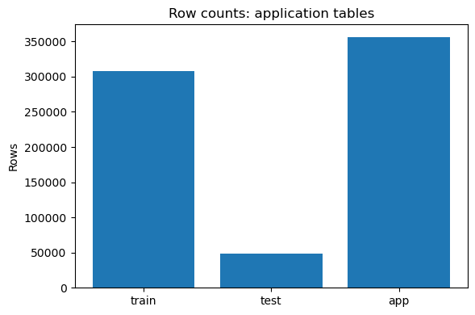
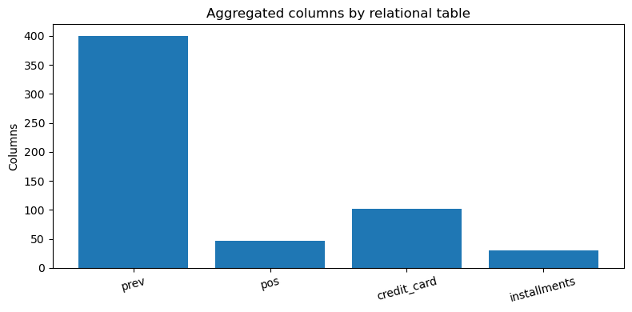
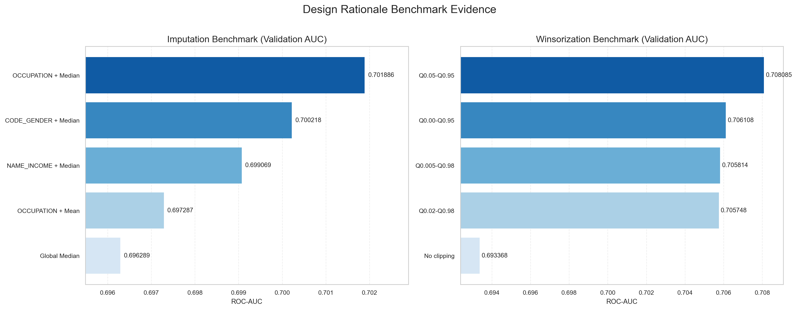
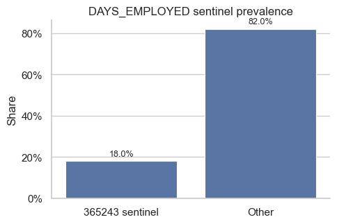
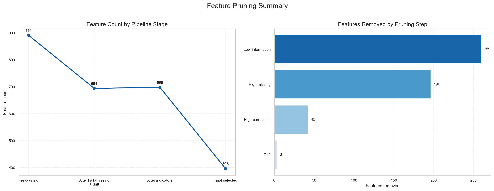
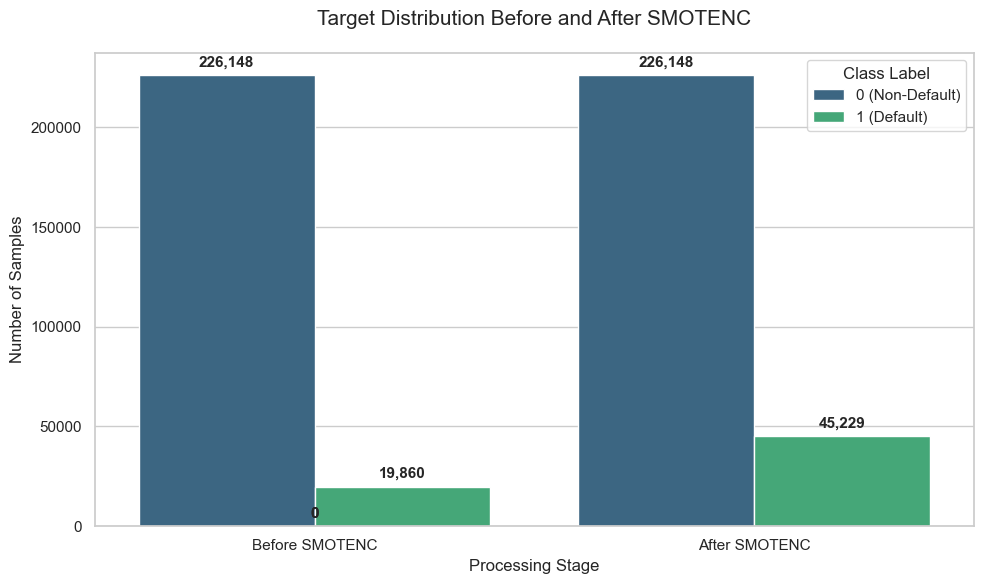

# STAT GU4243/5243 Project 1 Report
## Home Credit Default Risk: Data Acquisition, Cleaning, Preprocessing, and Feature Engineering

**Course:** STAT GU4243/5243  
**Github Repository:** https://github.com/olddoorhead/5243Project1  
**Primary Notebook:** `Project_1.ipynb`

## Executive Summary

- **Data integration:** We consolidated all core `Home Credit Default Risk` relational sources into a joined application-level table of **356,255 rows x 894 columns**.
- **Split discipline:** We used stratified 80/20 train-validation splitting first, preserving class balance at **0.080729** (train) and **0.080728** (validation).
- **Feature control:** Cleaning and pruning reduced feature width from **891** to **396** (**495 net features removed**) while preserving model-ready structure.
- **Validation gains:** Grouped imputation and winsorization improved validation ROC-AUC from **0.693368** (no clipping baseline) to **0.708085**.
- **Imbalance handling:** Using SMOTENC on training set only to raise minority prevalence from **8.07%** to **16.67%** and added **25,369** synthetic training rows.
- **Final artifacts:** Exported matrices are consistent for downstream modeling: Train **(271,377, 396)**, Validation **(61,503, 396)**, Test **(48,744, 396)**.

## Rubric Coverage and Evidence

| Requirements | Evidence location |
| --- | --- |
| Data acquisition methodology | Section 1.2, Section 1.3, Figure 1, Figure 2, Appendix Figure A1 |
| Data cleaning and inconsistency handling | Section 1.4, Section 4.1, Figure 8, Appendix Table A1, Appendix Table A2, Appendix Table A6 |
| EDA with patterns, distributions, anomalies | Section 3, Figure 5-Figure 8, Appendix Figure A2-Appendix Figure A7 |
| Preprocessing and feature engineering with justification | Section 2.2, Section 4.1, Table 2, Table 4, Figure 4, Figure 9, Appendix Table A4, Appendix Table A5, Appendix Table A7 |
| Structured methodology and findings | Sections 1-8, Figure 3, Table 2, Table 3, Table 4 |
| Summary of key findings | Section 6 |
| Challenges and limitations | Section 7 |
| Future recommendations | Section 8 |
| Public GitHub reference | Header repository link |
| Team member contribution statement | Section 9 |

*Table 1: Rubric-to-report evidence mapping.*

Hint: Evidence labels prefixed with `A` (for example, `Appendix Figure A4` and `Appendix Table A5`) are in `Appendix.md`.

## 1. Problem Statement and Data

### 1.1 Objective
Develop an auditable, leakage-aware preprocessing and feature-engineering pipeline for default-risk modeling readiness on the Home Credit dataset. The project scope explicitly covers acquisition, cleaning, EDA, preprocessing, feature engineering, and export of finalized modeling datasets.

### 1.2 Data Acquisition

- **Source:** Kaggle Home Credit Default Risk competition data.
- **Acquisition mode:** Public CSV download and local ingestion.
- **Files used:**
    - **Application tables:** `application_train.csv`, `application_test.csv`
    - **Bureau tables:** `bureau.csv`, `bureau_balance.csv`
    - **Behavioral history:** `previous_application.csv`, `POS_CASH_balance.csv`
    - **Card and installment history:** `credit_card_balance.csv`, `installments_payments.csv`

### 1.3 Dataset Scope and Split Strategy

- **Application union shape:** **(356,255, 123)** after train/test schema alignment.
- **Post-aggregation shape:** **(356,255, 894)** after customer-level joins.
- **Modeling matrices after leakage-safe drops (`TARGET`, `SK_ID_CURR`, `_is_train`):**
    - **Train candidates:** **(307,511, 891)**
    - **Test candidates:** **(48,744, 891)**
- **Stratified split on train rows only:**
    - **Training fold:** `X_tr_raw` **(246,008, 891)**, positive rate **0.080729**
    - **Validation fold:** `X_val_raw` **(61,503, 891)**, positive rate **0.080728**

*Figure 1: Row counts for application train, test, and combined table.*

*Figure 2: Aggregated column contributions by relational source table.*

### 1.4 Leakage and Reproducibility Controls

- **Split-first protocol:** All fit-dependent transformations were trained on the training fold before validation/test application.
- **Consistent transforms:** Threshold-based feature removal was applied identically across train/validation/test once selected.
- **Traceability:** Feature-drop logs and final matrix exports were written deterministically to `log/` and `cleaned_dataset/`.

## 2. Method and Design Rationale

  <h3>2.1 Pipeline Architecture</h3>
  
  
<em>Figure 3: Project Pipeline from Acquisition to Export.</em>

### 2.2 Design Rationale

The pipeline was intentionally designed around risk-control decisions rather than only maximizing short-run validation scores. The key design choices and supporting evidence are summarized below.

#### 2.2.1 Split-Before-Transform Logic

- **Rationale:** Any transformation learned on full data can leak distributional information from validation/test into training.
- **Implementation:** Stratified split is executed before grouped statistics, scaling parameters, clipping bounds, and feature filtering.
- **Benefit:** Ensures validation metrics reflect realistic out-of-sample behavior and guards against optimistic bias.

#### 2.2.2 PSI Threshold Selection (0.15)

- **Rationale:** PSI values above **0.15** are commonly treated as meaningful distribution drift for monitoring and feature stability review.
- **Implementation:** Numeric features were flagged when **PSI > 0.15**; categorical features were flagged when **L1 share shift > 0.15**.
- **Observed effect:** Three unstable features were removed before final modeling.

#### 2.2.3 Grouped Imputation Choice

- **Rationale:** Global imputation can dilute subgroup structure in credit-risk data.
- **Implementation:** We benchmarked grouped mean/median imputations across candidate grouping fields.
- **Selected policy:** `OCCUPATION_TYPE + Median` achieved the highest validation AUC (**0.701886**), outperforming global median baseline (**0.696289**).

#### 2.2.4 Winsorization Choice

- **Rationale:** Extreme tails in credit variables can destabilize linear decision boundaries and scaling.
- **Implementation:** Quantile clipping bounds were tuned against validation ROC-AUC on a high-variance feature subset.
- **Selected policy:** **Q0.05-Q0.95** clipping improved AUC to **0.708085** versus **0.693368** without clipping.

#### 2.2.5 Low-Information Pruning

- **Rationale:** Features that are constant or nearly constant across training rows add little predictive value and can introduce avoidable noise.
- **Implementation:** Dropped near-constant features when dominant share `>= 0.999`.
- **Observed effect:** Removed **259 low-information features**, reducing the matrix to **438 features** before correlation pruning.

#### 2.2.6 Correlation Pruning Threshold

- **Rationale:** Highly collinear features increase redundancy and can inflate model variance without adding signal.
- **Implementation:** For feature pairs with correlation above **0.98**, we kept the stronger target-associated feature (or higher variance on ties).
- **Observed effect:** **42** highly collinear features were removed, contributing to a compact final matrix.

| Design control | Selected value | Practical purpose | Outcome |
| --- | --- | --- | --- |
| Drift control | PSI > 0.15; L1 shift > 0.15 | Remove unstable features | 3 features removed |
| Grouped imputation | `OCCUPATION_TYPE + Median` | Preserve subgroup signal | +0.005597 AUC vs global median |
| Winsorization | Q0.05 to Q0.95 | Reduce outlier leverage | +0.014717 AUC vs no clipping |
| Low-Information pruning | Near constant | Remove redundant predictors | 259 features removed |
| Correlation pruning | > 0.98 | Remove redundant predictors | 42 features removed |

*Table 2: Design-control decisions and observed outcomes.*

*Figure 4: Benchmark evidence supporting grouped imputation and winsorization decisions.*

### 2.3 Alternative Designs Considered and Rejected

The final method was selected after comparing practical alternatives that were technically valid but less suitable for this dataset and assignment scope.

- **Transform-before-split pipeline**
    - **Alternative:** Fit imputers/scalers on the full joined training table before creating holdout folds.
    - **Why rejected:** This introduces subtle information bleed from validation rows into train-fitted preprocessing states.
    - **Expected impact if used:** Inflated validation scores and weaker reproducibility when retraining on fresh data.

- **Stricter drift threshold (PSI > 0.10)**
    - **Alternative:** Remove all features with mild-to-moderate shift.
    - **Why rejected:** At this feature scale, a 0.10 threshold can over-remove useful predictors and reduce signal diversity.
    - **Expected impact if used:** Lower model capacity due to aggressive feature elimination.

- **Looser drift threshold (PSI > 0.25)**
    - **Alternative:** Keep most features unless drift is severe.
    - **Why rejected:** This allows unstable predictors to persist and increases deployment fragility.
    - **Expected impact if used:** Higher risk of train-to-test instability and inconsistent score behavior.

- **Global-only imputation**
    - **Alternative:** Use one median/mean value per feature for all borrowers.
    - **Why rejected:** It collapses subgroup structure (income/occupation profile effects) and reduced validation AUC.
    - **Expected impact if used:** Weaker discrimination in heterogeneous borrower cohorts.

- **More aggressive clipping (e.g., Q0.01-Q0.99 or one-sided heavy clipping)**
    - **Alternative:** Clip fewer or more extreme values depending on tail assumptions.
    - **Why rejected:** Benchmarks showed inferior AUC compared with Q0.05-Q0.95.
    - **Expected impact if used:** Either residual outlier leverage (too weak) or excessive signal compression (too strong).

- **Lower correlation threshold (0.95)**
    - **Alternative:** Remove broader groups of correlated features.
    - **Why rejected:** It risks dropping too many informative near-duplicate aggregates in relational credit features.
    - **Expected impact if used:** Reduced feature richness without clear robustness gain.

- **Higher correlation threshold (0.995)**
    - **Alternative:** Prune only near-identical columns.
    - **Why rejected:** Leaves too much redundancy and raises downstream variance/multicollinearity risk.
    - **Expected impact if used:** Less stable coefficient-based models and noisier interpretation.

### 2.4 Design Risk Register

| Design decision | Main risk if mis-specified | Mitigation used in this project |
| --- | --- | --- |
| Split-before-transform | Holdout leakage through preprocessing statistics | Train-fold fitting only; strict fold isolation |
| Drift filtering thresholds | Over-pruning or under-pruning unstable features | Balanced thresholds with explicit audit counts |
| Grouped imputation policy | Overfitting to sparse groups or weak global fallback | Group + global fallback + validation benchmarking |
| Winsorization bounds | Signal loss from over-clipping or outlier dominance from under-clipping | Quantile grid search using validation ROC-AUC |
| Correlation pruning cutoff | Loss of useful predictors or retained redundancy | Signal-aware pairwise selection and variance tie-breaks |

*Table 3: Design-risk register and mitigation actions.*

## 3. Exploratory Data Analysis

### 3.1 Target Imbalance

- **Class profile:** Training labels are heavily skewed (about **91.9%** class 0, **8.1%** class 1).
- **Implication:** Imbalance-aware preprocessing is required before classifier training.

.png)
*Figure 5: Target-class distribution in the original training data.*

### 3.2 Missingness Patterns

- **Broad profile:** **75.8%** of features have missing rate below 0.5.
- **High-missing block:** **24.2%** of features (**216 columns**) have missing rate at or above 0.5.
- **Structural signal:** Missingness is concentrated in specific relational families rather than uniformly random.

.png)
*Figure 6: Distribution of missing rates across joined application-level features.*

.png)
*Figure 7: Highest-missing columns in the joined feature space.*

### 3.3 Sentinel and Integrity Checks

- **Sentinel diagnostic:** `DAYS_EMPLOYED = 365243` appears in roughly **18%** of rows and was explicitly handled.
- **Key integrity:** Duplicate-row and primary-key audits showed no duplicate keys in major joined tables.

*Figure 8: Prevalence of sentinel DAYS_EMPLOYED values.*

## 4. Preprocessing and Feature Engineering

### 4.1 Core Processing Sequence

- **High-missing filter:** Threshold **0.65** on training fold, removing **196** features.
- **Drift filter:** PSI/L1 thresholds from Section 2.2 removed **3** unstable features.
- **Indicator features:** Added social-circle, bureau-request, and phone-change missingness flags.
- **Numeric imputation:** Applied selected grouped median policy using train-fitted statistics.
- **Categorical imputation:** Filled categorical NaNs with explicit `Missing` token.
- **Outlier handling:** Applied selected winsorization bounds to continuous numeric features.
- **Encoding/scaling:** Ordinal encoding plus scaled continuous numerics.
- **Final pruning:** Removed **259** low-information and **42** high-correlation features.

### 4.2 Feature-Count Audit

| Stage | Training shape | Change vs prior |
| --- | --- | --- |
| Pre-pruning matrix | (246,008, 891) | - |
| After high-missing and drift filtering | (246,008, 694) | -197 |
| After indicator additions | (246,008, 698) | +4 |
| Final selected matrix | (246,008, 396) | -302 |

*Table 4: Feature-count changes across the preprocessing pipeline.*

*Figure 9: Side-by-side pruning summary (stage counts and per-step removals).*

## 5. Modeling-Oriented Validation Results

### 5.1 Metric and Evaluation Setup

- **Validation protocol:** Stratified holdout split from original training rows.
- **Primary metric:** ROC-AUC to compare preprocessing strategy variants.
- **Usage:** Results guide preprocessing design, not final classifier ranking.

### 5.2 AUC Progression

- **No clipping baseline:** **0.693368**
- **Global median baseline (grouping disabled):** **0.696289**
- **Best grouped imputation:** **0.701886**
- **Best winsorized pipeline:** **0.708085**

.png)
*Figure 10: Clean validation AUC comparison of baseline and selected preprocessing configurations.*

### 5.3 SMOTENC Rebalancing Outcome

- **Before SMOTENC:** Training target rate **8.07%**, shape **(246,008, 396)**.
- **After SMOTENC:** Training target rate **16.67%**, shape **(271,377, 396)**.
- **Synthetic increase:** **25,369** rows.

*Figure 11: Class-count comparison before and after SMOTENC.*

## 6. Key Findings

1. **Relational signal consolidation:** Aggregation across bureau, installment, card, and previous-loan tables produced a high-signal candidate feature base.
2. **Risk-controlled preprocessing:** Split-first and threshold-based filtering reduced leakage and instability exposure.
3. **Meaningful validation uplift:** Grouped imputation and winsorization together improved validation discrimination.
4. **Efficient feature space:** The final selected matrix (396 features) preserves key signal while removing substantial redundancy/noise.
5. **Ready outputs:** Final train/validation/test artifacts are aligned for downstream model benchmarking.

## 7. Limitations and Challenges

- **Scope boundary:** This report centers on data pipeline quality; full classifier sweep and tuning remain future work.
- **Drift governance:** Unlabeled test-distribution drift checks are useful for stability but should be controlled carefully in strict blind evaluation pipelines.
- **Interpretability gap:** Current deliverable does not yet include SHAP-level global/local interpretation or subgroup fairness diagnostics.
- **Calibration gap:** Additional probability calibration diagnostics (e.g., reliability curves, Brier score) are still needed.

## 8. Next Steps

1. **Model benchmarking:** Compare Logistic Regression, LightGBM, and XGBoost on finalized features.
2. **Metric expansion:** Add PR-AUC, recall-at-precision, and calibration diagnostics alongside ROC-AUC.
3. **Ablation testing:** Compare no resampling, SMOTENC, and class-weighted learners.
4. **Monitoring design:** Track drift on top predictors and score distributions with threshold-driven retraining rules.

## 9. Team Contributions

- **Zhewei Deng:** data integration, EDA diagnostics, missingness analysis, validation checks, report consolidation and packaging of final deliverables. 
- **Xiying Chen:** EDA diagnostics, drift/missingness analysis, and quality audit contributions.
- **Kexuan Liu:** feature engineering, imputation/outlier benchmarking, and pruning logic.
- **Yumeng Xu:** report consolidation, result interpretation, and packaging of final deliverables.

There is no significant difference in the effort put in by team members.

---

Extended tables and additional figures are provided in the separate appendix: `Appendix.pdf`.
